# robot-detector

Zero-shot robot arm detection using [CNOS](https://github.com/nv-nguyen/cnos) (segmentation proposals + DINOv2 template matching). The proposal segmentor is selectable, FastSAM or SAM ViT-H; **the shipped configs all use `segmentor: sam`** (FastSAM remains available via `--segmentor fastsam`).

Given a dataset and the robot's joint configuration, `robot-detector` produces a JSON file with per-frame bounding boxes and segmentation masks, meant to be consumed by downstream pose estimation pipelines that require upstream detection.

No robot-specific training is needed: detection uses rendered templates from `robot-renderer` as references.

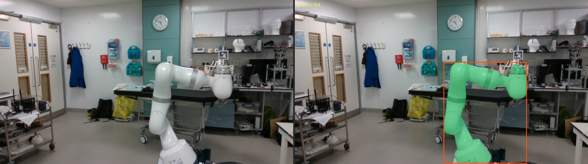

Input frame and detection. Six arms across five datasets, see
[Example detections](#example-detections).

---

## Repo structure

```text
robot-detector/
|-- external/
|   |-- cnos/                # git submodule (nv-nguyen/cnos, pinned)
|   `-- robot-renderer/      # git submodule (tjayada/robot-renderer, pinned)
|-- loaders/                 # one reader per dataset, registered in __init__.py
|   |-- baxter.py
|   |-- dream.py
|   |-- craves.py
|   |-- hydra.py
|   `-- realsense_franka.py
|-- configs/                 # one YAML per dataset (dataset + robot + renderer + detector)
|   |-- baxter.yaml
|   |-- panda_orb.yaml
|   |-- craves.yaml
|   |-- lbr_med7.yaml
|   |-- xarm7.yaml
|   |-- meca500.yaml
|   `-- realsense_franka.yaml
|-- detections/
|   |-- sam/                 # shipped JSONs, SAM segmentor (default; reported results)
|   `-- fastsam/             # shipped JSONs, FastSAM segmentor (for comparison)
|-- figures/                 # example detection overlays used in this README
|-- tests/                   # dependency-light unit tests (no weights/GPU/datasets)
|-- tools/
|   |-- check_panda_coverage.py
|   |-- segmentor_iou.py
|   `-- segmentor_iou.sh
|-- detector.py              # RobotDetector: proposals + DINOv2 template matching
|-- detect_utils.py          # pure-numpy helpers (K scaling, frame selection)
|-- run_detect.py            # CLI: run detection over a dataset
|-- run_all_detections.sh    # regenerate every shipped JSON
|-- visualize.py             # overlay detections on images
|-- Makefile
|-- LICENSE                  # MIT (this repo's code)
`-- THIRD_PARTY.md           # CNOS / SAM / DINOv2 / ultralytics licenses
```

`robot-renderer` is a git submodule at `external/robot-renderer/`, installed
editable (see the robot-renderer dependency section below).

---

## Installation

### 1. Clone with submodules

```bash
git clone --recurse-submodules https://github.com/tjayada/robot-detector
cd robot-detector
```

Or if already cloned:

```bash
make submodules
```

### 2. Create the conda environment

```bash
conda create -n cnos python=3.10 pip -c conda-forge -y
conda activate cnos
```

### 3. Run setup

```bash
make setup
```

This chains all install steps automatically with visible output:

1. PyTorch + torchvision (`make install-torch`)
2. PyTorch3D (`make install-pt3d`)
3. CNOS dependencies: pytorch-lightning, torchmetrics, omegaconf, tqdm, pyyaml, ... (`make install-cnos`)
4. Segment Anything Model, SAM (`make install-sam`)
5. FastSAM via ultralytics==8.0.135 (`make install-fastsam`)
6. robot-renderer (`make install-renderer`)
7. Segmentor weights into `~/.cache/cnos/` (`make weights`): `FastSAM-x.pt` (via `gdown`) **and** `sam_vit_h_4b8939.pth` (SAM ViT-H, ~2.4 GB, required by the shipped configs, which use `segmentor: sam`)

The CRAVES (`owi535`) and Meca500 renderer meshes cannot be redistributed and
are therefore fetched locally. If you want to run either of those two configs,
also run:

```bash
pip install -e "external/robot-renderer[assets]"
make -C external/robot-renderer assets
```

### 4. Verify

```bash
make check
```

Expected output:
```
torch: 2.x.x+cuXXX
pytorch_lightning: ok
ultralytics: ok
segment_anything: ok
robot_renderer: ok
detector: ok
All checks passed.
```

Then run the unit tests:

```bash
pip install pytest
make test
```

The tests cover config consistency, K-scaling and frame selection,
checkpoint/resume behavior, the RLE mask encoding round-trip, and all four
dataset loaders (on tiny synthetic datasets). They need numpy, PIL, PyYAML,
pytest, and torch/torchvision, but no GPU, model weights, or real datasets.

---

## Running detection

Activate the conda env first:

```bash
conda activate cnos
```

One command per dataset, differing only in the config and the data folder:

```bash
python run_detect.py \
    --config configs/baxter.yaml \
    --data_folder /path/to/baxter-real-dataset \
    --output detections/sam/baxter.json
```

The three Hydra arms share the `hydra` loader, so `--data_folder` is the robot
root containing `measurement_0..N/` and frame IDs come out as `meas{M}_{F:03d}`.

RealSense-Franka (`configs/realsense_franka.yaml`, Panda arm) is likewise a root
of D415 view subdirs, so `--data_folder` is that root and frame IDs come out as
`{view}/{F:06d}`.

An `--output` name ending in `.json.gz` is written gzipped and without
indentation. 

`--subsample N` detects N evenly spaced frames instead of all of them
(`np.linspace` index selection, rounded, duplicates removed).

### CLI overrides

Any detector setting can be overridden on the command line without editing the YAML:

```bash
python run_detect.py \
    --config configs/baxter.yaml \
    --data_folder /path/to/baxter \
    --output detections/baxter.json \
    --confidence_threshold 0.3 \
    --segmentor sam
```

Run on specific frames only (useful for debugging):

```bash
python run_detect.py \
    --config configs/craves.yaml \
    --data_folder /path/to/test_20181024 \
    --output detections/craves_debug.json \
    --frames 0 1 5
```

### Checkpoints and resuming

Each completed frame is appended to `<output>.partial.jsonl`. The journal is
flushed after every frame and durably synced every 10 frames by default, so an
interrupted long run does not lose all previous detections. Resume with the
same arguments plus `--resume`:

```bash
python run_detect.py \
    --config configs/panda_orb.yaml \
    --data_folder /path/to/panda-orb \
    --output detections/sam/panda_orb.json.gz \
    --resume
```

Resume fails if the config, camera information, or frame selection differs
from the checkpoint. Use `--checkpoint_every N` to change the durable sync
interval. On success, the final JSON is written atomically and the partial
journal is removed.

---

## Output format

A single JSON file per dataset:

```json
{
  "dataset": "baxter_real",
  "robot": "baxter_left_arm",
  "segmentor": "sam",
  "num_frames": 100,
  "num_detected": 100,
  "detection_rate": 1.0,
  "detections": [
    {
      "image_id": 0,
      "frame_id": "pose_0_0000",
      "found": true,
      "score": 0.5336,
      "time_ms": 48421.8,
      "bbox_xyxy": [473.0, 576.0, 1507.0, 787.0],
      "segmentation": {"counts": [...], "size": [1536, 2048]}
    },
    ...
  ]
}
```

Verbatim from `detections/sam/baxter.json.gz`; the first frame's `time_ms`
includes one-off model warm-up (frame 1 takes 6.2 s).

`bbox_xyxy` and `segmentation` are `null` when `found` is `false`. A
`.json.gz` file holds the same document, gzipped and without indentation.

### Units and conventions

- Detection always runs at the dataset's **native resolution**, HxW: Baxter
  1536x2048, panda-orb 480x640, CRAVES and Hydra 720x1280. `bbox_xyxy` is
  `[x1, y1, x2, y2]` in pixels at that resolution.
- `segmentation` is a COCO-style **column-major** RLE: the mask is flattened
  column by column (Fortran order), and `counts` alternates run lengths
  starting with the run of zeros (a mask whose first pixel is set starts with
  a zero-length count). `size` is `[H, W]`.
- Joint angles read by the loaders are in **radians** (the CRAVES loader
  converts from degrees itself).
- Intrinsics `K` are standard 3x3 pixel-unit matrices at native resolution;
  for template rendering they are rescaled to the square render size with
  center-crop semantics (`detect_utils.scale_K_to_render`).

### Shipped detections

Pre-computed detections for all datasets ship in `detections/`, generated via
`./run_all_detections.sh`:

- `detections/sam/`: SAM ViT-H segmentor (the shipped default)
- `detections/fastsam/`: FastSAM segmentor (the BOP default-detections
  source), provided for comparison

Every dataset covers its full split and ships gzipped (`.json.gz`) for a
uniform format. All were generated with robot-detector **v1.1.0** and are
unchanged since.

To reproduce the shipped files: edit the paths at the top of
`run_all_detections.sh` (repo path, python, one dataset folder per line), then
run it. Budget ~5.5 days, nearly all of it panda-orb. Keeping your edited copy
as `run_all_detections.local.sh` keeps it out of version control (that name is
gitignored). After the panda-orb run:

```bash
python tools/check_panda_coverage.py \
    --detections detections/sam/panda_orb.json.gz \
    --data_folder /path/to/panda-orb
```

---

## Visualisation

Overlay detection results on images:

```bash
python visualize.py \
    --detections detections/sam/baxter.json.gz \
    --data_folder /path/to/baxter-real-dataset \
    --num_samples 20 \
    --output_dir visualizations/baxter
```

Output is at the dataset's native resolution. Pass `--side-by-side` to place
the unmodified original next to the overlay, and `--max_width N` to draw at
most N pixels wide.

### Example detections

Frame 0 of every dataset, the same frame for both segmentors. Green is the
mask, orange is the bounding box, and the number is the template-matching
score. The files in [`figures/`](figures/) come from the command above with
`--frames 0 --max_width 720`; both segmentors write the same output filename,
so render into a scratch directory and rename.

| Robot | FastSAM | SAM (shipped default) |
|---|---|---|
| **Baxter** (`baxter_left_arm`)<br>[baxter-real](https://drive.google.com/file/d/12bCv6GBuh-FdvLGKjlUx2jPN-DBRUqUn/view), 1536x2048 | 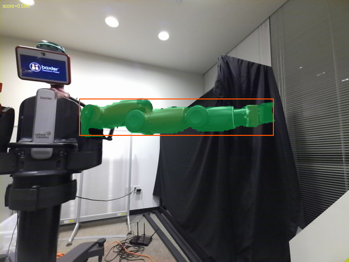<br>score 0.586 | 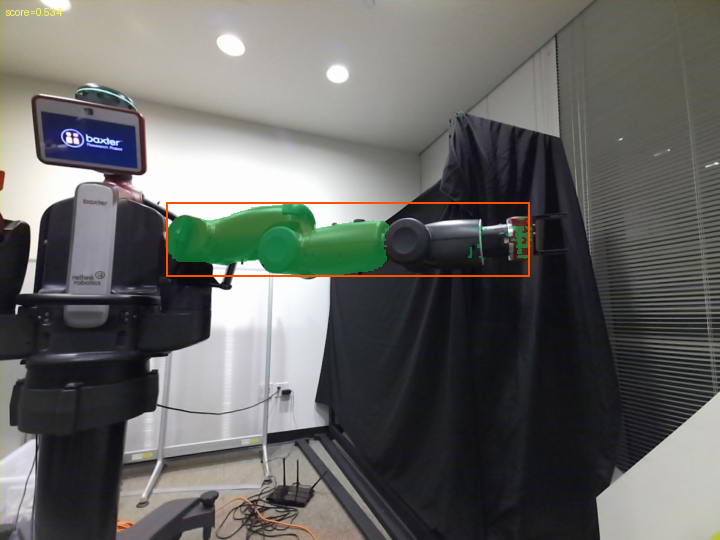<br>score 0.534 |
| **Panda** (`panda`)<br>[panda-orb](https://github.com/NVlabs/DREAM/blob/master/data/DOWNLOAD.sh), 480x640 | 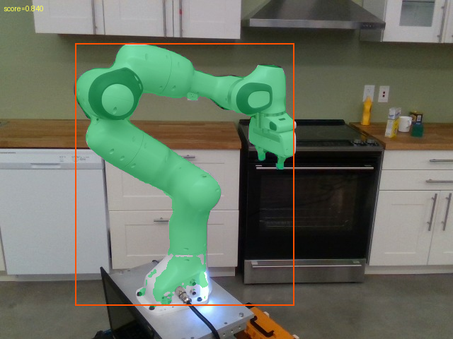<br>score 0.840 | 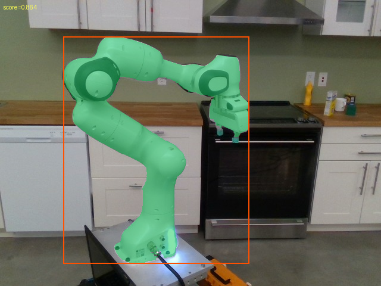<br>score 0.864 |
| **OWI-535** (`owi535`)<br>[CRAVES](https://www.paris.inria.fr/archive_ylabbeprojectsdata/robopose/), 720x1280 | 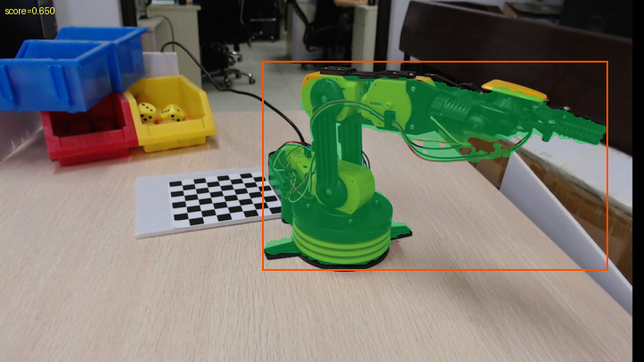<br>score 0.650 | 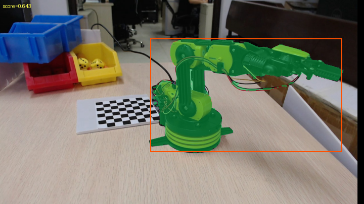<br>score 0.643 |
| **LBR Med7** (`lbr_med7`)<br>[Hydra](https://github.com/tjayada/hydra-data-calibration), 720x1280 | 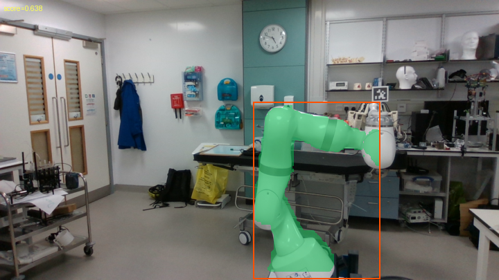<br>score 0.638 | <br>score 0.764 |
| **xArm7** (`xarm7`)<br>[Hydra](https://github.com/tjayada/hydra-data-calibration), 720x1280 | 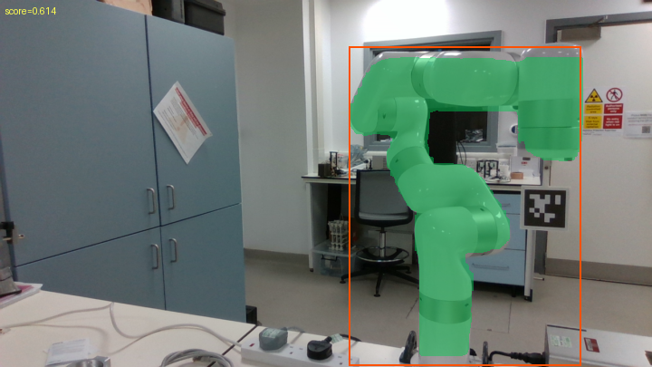<br>score 0.614 | 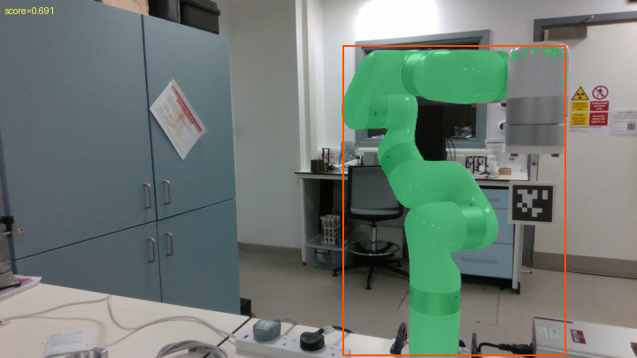<br>score 0.691 |
| **Meca500** (`meca500`)<br>[Hydra](https://github.com/tjayada/hydra-data-calibration), 720x1280 | 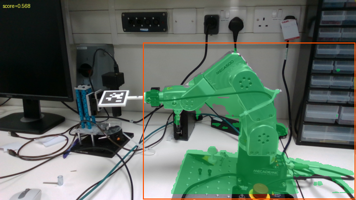<br>score 0.568 | 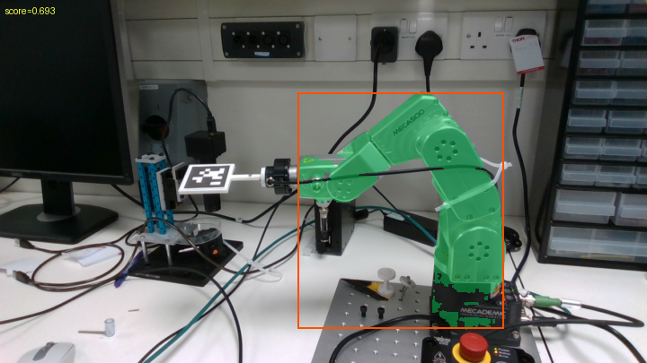<br>score 0.693 |
| **Panda** (`panda`)<br>[RealSense-Franka](https://github.com/Nimolty/RoboKeyGen/tree/main#real-world-testing-dataset-realsense-franka-and-azurekinect-franka), 360x640 | 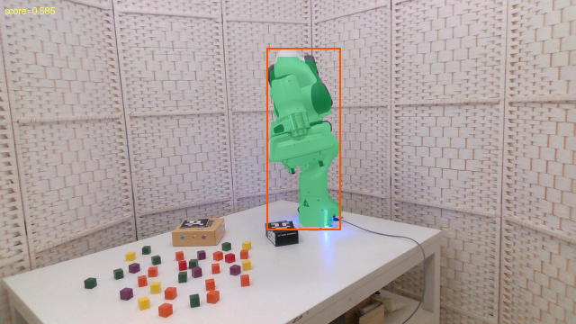<br>score 0.585 | 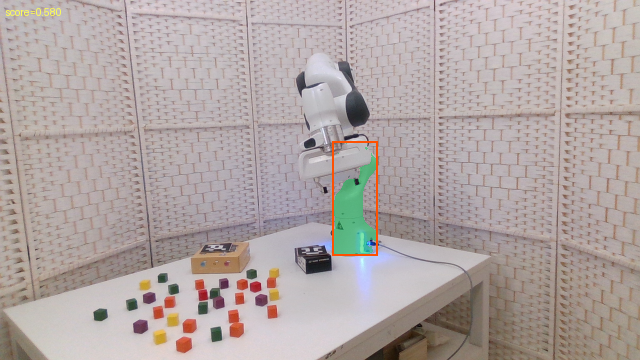<br>score 0.580 |

Both segmentors return a detection in every frame of every dataset, so the
shipped JSONs all have a detection rate of 1.0. They differ in how much of the
arm the mask covers: across the full datasets the two masks overlap with a mean
IoU of 0.66 (Meca500) to 0.81 (CRAVES).

### Segmentor choice: SAM vs FastSAM

`tools/segmentor_iou.py` scores each mask against the GT arm: it renders the robot at
its GT camera pose and joint state (robot-renderer, occlusion-correct) and
reports the mean IoU with the detector mask. It runs on the three Hydra arms,
which ship a GT camera pose (`T_cam_base.npy`) per measurement.

```bash
python tools/segmentor_iou.py \
    --detections detections/sam/lbr_med7.json.gz \
    --data_folder /path/to/hydra_eval/lbr
```

`tools/segmentor_iou.sh` loops both segmentors over the three arms.

| Robot | SAM mean IoU | FastSAM mean IoU |
|---|---|---|
| LBR Med7 | 0.927 | 0.704 |
| xArm7 | 0.843 | 0.773 |
| Meca500 | 0.797 | 0.652 |

SAM scores higher on every arm, so it is the shipped default.

---

## robot-renderer dependency

`robot-renderer` is a git submodule at `external/robot-renderer/`, pinned to a
recorded commit (like `external/cnos`). `make submodules` fetches it, and it is
installed editable via:

```bash
pip install -e external/robot-renderer
```

(Handled automatically by `make install-renderer` or `make setup`.)
